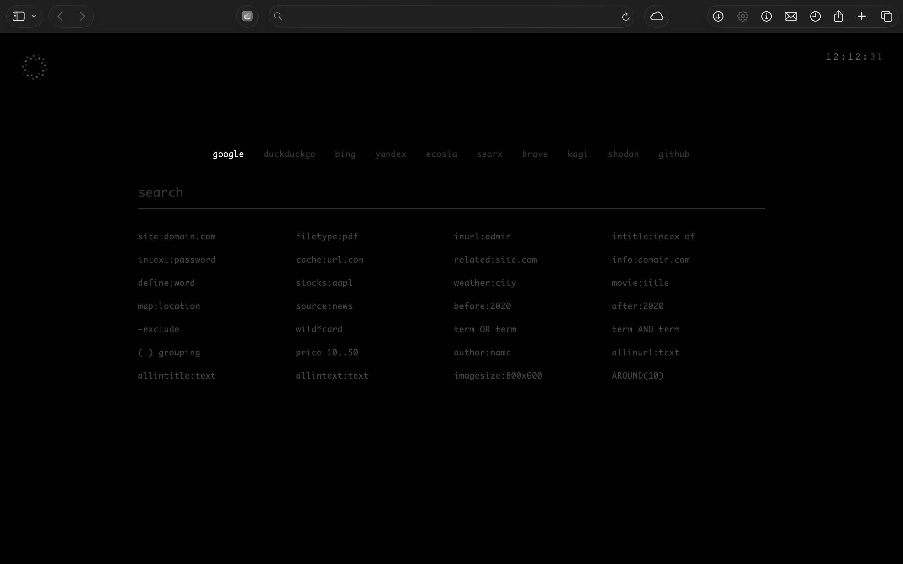
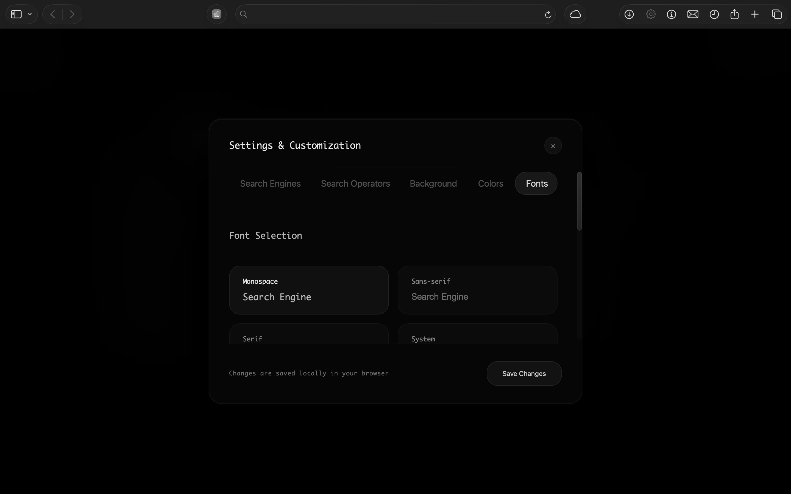
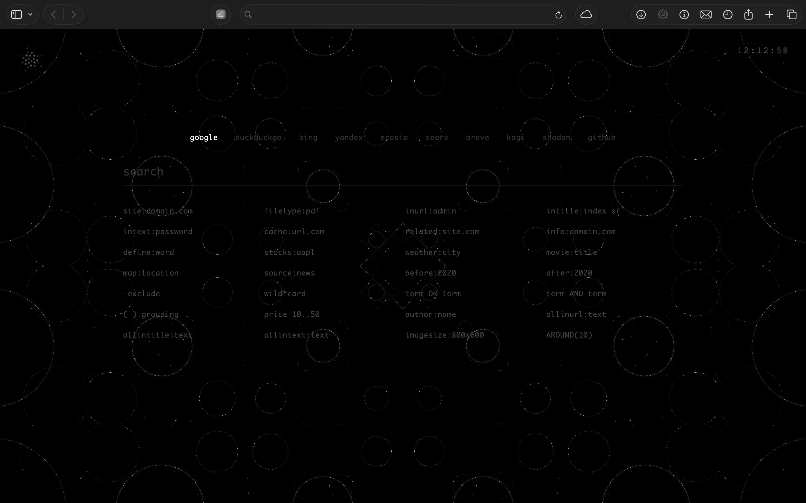

# DorkStart

A beautiful,highly customizable startpage for your browser featuring a clean interface, multiple search engines, and dynamic visual effects including animated mandala backgrounds and spiral patterns.

##  Features

###  Multi-Engine Search
- **9+ Search Engines support**: Google, DuckDuckGo, Bing, Yandex, Ecosia, Searx, Brave, Kagi, Shodan, GitHub + Custom search engines
- **Search Operators, Better dorking**: Specialized operators for each search engine (site:, filetype:, inurl:, etc.)
- **Keyboard Shortcuts**: Quick switching between search engines
- **Custom Engines**: Add your own search engines through the settings panel

###  Visual Customization
- **WebGL Mandala Art**: Animated background with customizable patterns
- **spiral Animation**: Mathematical spiral patterns in the settings button
- **Custom Backgrounds**: Solid colors, gradients, or upload your own images
- **Font Selection**: Multiple font families with size controls
- **Color Themes**: Customize text, background, and accent colors
- **Real-time Preview**: See changes instantly while customizing

###  Advanced Settings
- **Persistent Storage**: All customizations saved in localStorage
- **Import/Export**: Backup and restore your settings
- **Responsive Design**: Works on desktop, tablet, and mobile
- **Glassmorphism UI**: Modern blurred glass effects throughout

##  Screenshots

### Main Interface

*Clean, minimalist interface with search functionality and real-time clock*

### Settings Panel

*Comprehensive settings with tabbed interface for customization*

### Mandala Background

*Animated WebGL mandala art background option*

##  Browser Setup Instructions

### Google Chrome / Chromium / Edge

#### Method 1: Extension (Recommended)
1. Install the "New Tab Redirect" extension from Chrome Web Store
2. Set the redirect URL to: `file:///path/to/your/startpage.html`
3. Replace `/path/to/your/` with the actual path to your HTML file

#### Method 2: Local Server (Alternative)
1. Use a local server (Python: `python -m http.server 5503`)
2. Set new tab page to `http://localhost:5503/startpage.html`
3. Use extensions like "New Tab Redirect" to set the URL

#### Method 3: Alternative Extensions
- **Custom New Tab URL** - Simple and lightweight
- **Tabliss** - Feature-rich with customization options
- **Momentum** - Popular choice with weather and todos

### Firefox

#### Method 1: Extension
1. Install "New Tab Override" from Firefox Add-ons
2. Set custom URL to: `file:///path/to/your/startpage.html`

#### Method 2: about:config (Advanced)
1. Type `about:config` in address bar
2. Search for `browser.newtab.url`
3. Set value to your HTML file path
4. Restart Firefox

### Safari

#### Method 1: Extension (Paid)
1. Install "Start" extension from App Store
2. Configure with your HTML file path

#### Method 2: System Preferences (Recommended)
1. Safari → Preferences → General
2. Set "New windows open with" to "Homepage"
3. Set homepage to your HTML file

### Opera

#### Built-in Customization
1. Opera Settings → Start page
2. Add custom background
3. Or use "Speed Dial" with custom URL

#### Extension Method
1. Install "Custom New Tab" extension
2. Set URL to your HTML file

### Brave Browser

#### Extension Method
1. Install "New Tab Redirect" from Chrome Web Store
2. Configure with your HTML file path

#### Built-in Settings
1. Brave Settings → New Tab Page
2. Choose "Custom" and set URL

## 🛠️ Local Development Setup

### Prerequisites
- Modern web browser with WebGL support
- Local web server (optional but recommended)


### File Structure
```
chrome/
├── startpage.html          # Main HTML file with embedded CSS/JS
├── screenshots/            # Preview images
│   ├── page.png           # Main interface
│   ├── settings.png       # Settings panel
│   └── mandala.png        # Mandala background
└── README.md              # This file
```

## ⌨️ Keyboard Shortcuts

| Shortcut | Action |
|----------|--------|
| `Ctrl/Cmd + K` | Focus search input |
| `1-9` | Switch between search engines |
| `Escape` | Close settings panel |
| `Enter` | Perform search |

##  Customization Options

### Search Engines
- Add custom search engines with name and URL
- Configure search parameters
- Set keyboard shortcuts
- Remove or reorder engines

### Search Operators
- Customize operators for each search engine
- Add specialized search functions
- Quick access to advanced search syntax

### Visual Themes
- **Background Options**:
  - Solid colors
  - Linear gradients
  - Radial gradients
  - Custom image uploads
  - Animated mandala patterns

- **Typography**:
  - SF Mono (default)
  - JetBrains Mono
  - Fira Code
  - Source Code Pro
  - IBM Plex Mono
  - Roboto Mono
  - Custom font size controls

- **Color Schemes**:
  - Text colors
  - Background colors
  - Accent colors
  - Hover effects
  - Real-time preview

##  Technical Features

### WebGL Mandala Art
- Hardware-accelerated rendering
- Customizable patterns and colors
- Smooth animations with 60fps performance
- Responsive to screen size

### Performance Optimizations
- Lazy loading of heavy components
- Efficient DOM manipulation
- Optimized CSS animations
- Minimal JavaScript footprint

### Browser Compatibility
- Chrome 90+
- Firefox 88+
- Safari 14+
- Edge 90+
- Opera 76+

##  Data Storage

All customizations are stored locally using browser's localStorage:
- Search engine preferences
- Visual customizations
- User-added content
- Settings backup/restore capability


##  Credits

- **GSAP**: Animation library for smooth transitions
- **Google Fonts**: Typography (Poppins font family)
- **WebGL**: Hardware-accelerated graphics
- **CSS3**: Modern styling and effects

